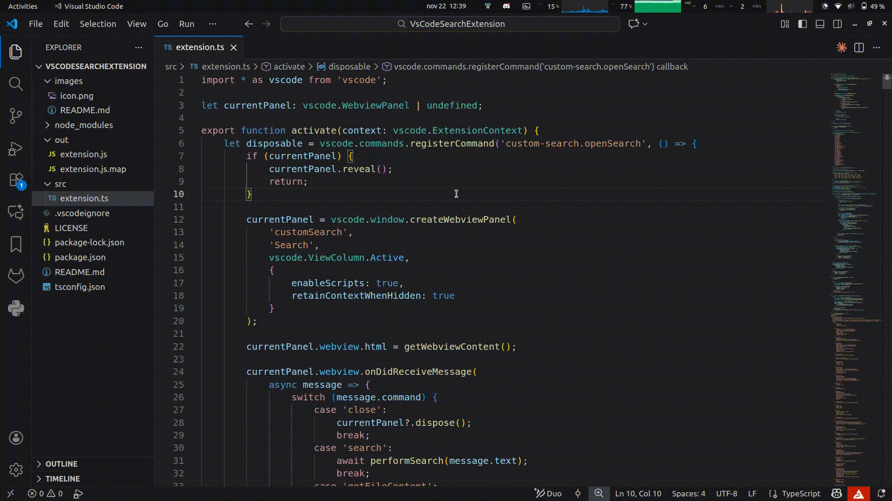
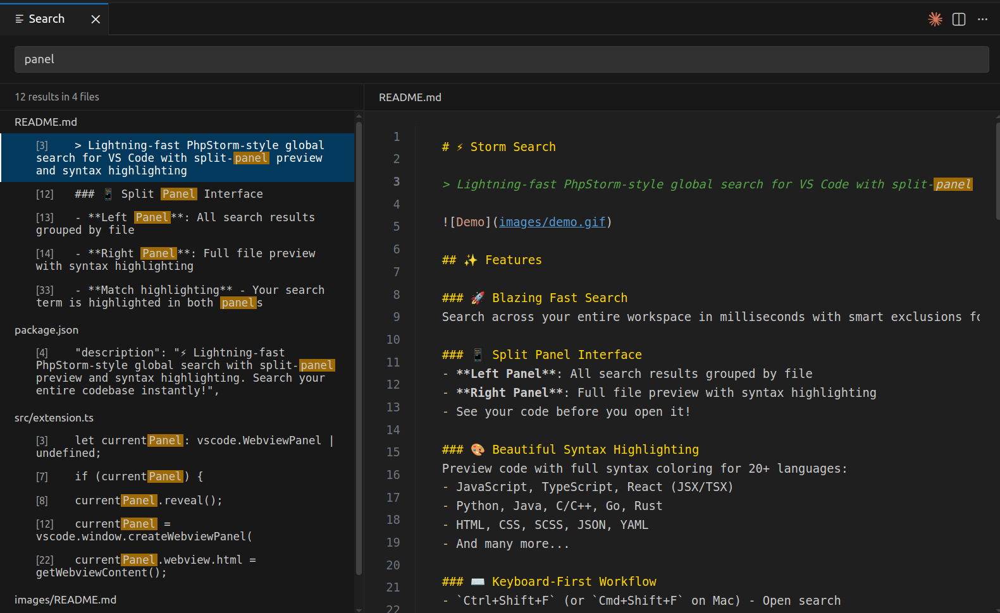
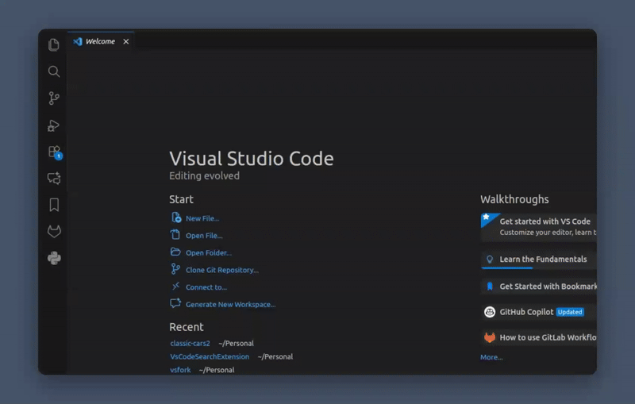

# Storm Search

[.svg)](https://app.openpledge.io/repositories/zigcBenx/storm-search)

> PhpStorm-inspired global search for VS Code with split-panel preview and syntax highlighting

[Install on the VS Code Marketplace](https://marketplace.visualstudio.com/items?itemName=Benxlabs.storm-search)

## Features

### Split Panel Interface
Inspired by PhpStorm's search experience, this extension provides a dual-panel view:
- **Left Panel**: Search results grouped by file
- **Right Panel**: Full file preview with syntax highlighting
- Preview files before opening them

### Keyboard-First Workflow
- `Ctrl+Shift+F` (or `Cmd+Shift+F` on Mac) - Open search
- `↑` / `↓` - Navigate through results
- `Enter` - Open file at matched line
- `Esc` - Close search

### Smart Search Features
- Automatically excludes node_modules, .git, build folders, and other common directories
- Live file preview with syntax highlighting while browsing results
- Match highlighting in both result list and preview
- File size limits to handle large codebases
- Debounced search for responsive typing experience

## Screenshot

## Installation

Install from the [VS Code Marketplace](https://marketplace.visualstudio.com/items?itemName=Benxlabs.storm-search) or search for "Storm Search" in the VS Code extensions panel.

## Usage

1. Press `Ctrl+Shift+F` (Windows/Linux) or `Cmd+Shift+F` (Mac)
2. Type your search query
3. Use arrow keys to navigate results
4. Press `Enter` to open the file at the exact match location
5. Press `Esc` to close

The search automatically ignores common build folders like `node_modules`, `.next`, `dist`, etc.

## Support

*Support this project by pledging to issues on [OpenPledge](https://app.openpledge.io/repositories/zigcBenx/storm-search) - fund features and bug fixes you care about*